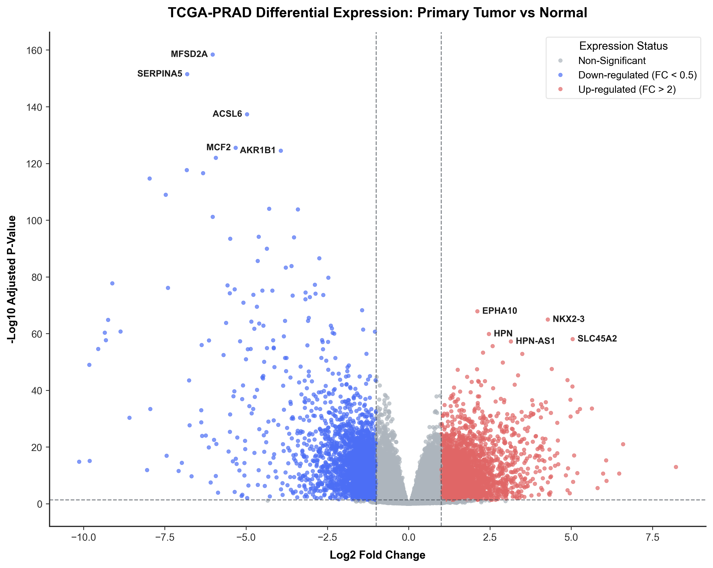
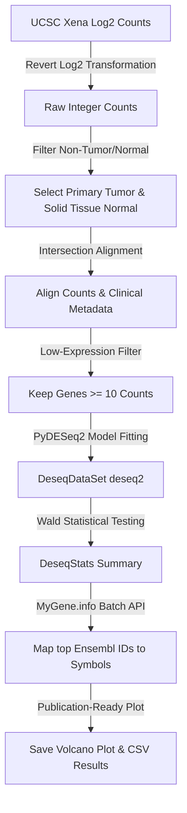

# 🧬 TCGA-PRAD Differential Gene Expression Pipeline

A high-performance, statistically rigorous bioinformatics pipeline for differential gene expression analysis (DGEA) comparing **Primary Tumor** vs. **Solid Tissue Normal** samples from the GDC TCGA Prostate Cancer (PRAD) cohort. The pipeline is implemented in Python using the modern `PyDESeq2` framework (re-implementing R's famous DESeq2 in Python).

---

## 📊 1. Visualization: Premium Volcano Plot

The volcano plot below illustrates the relation between fold change (x-axis) and statistical significance (y-axis). The top 10 most statistically significant genes have been mapped to their official HGNC symbols using a batch query to the MyGene.info API.

> [!TIP]
> **Plot Highlights:**
> - **Red Points (Right):** Up-regulated genes in primary tumors ($P_{adj} < 0.05$, $LFC > 1.0$, corresponding to a $>2\times$ fold increase).
> - **Blue Points (Left):** Down-regulated genes in primary tumors ($P_{adj} < 0.05$, $LFC < -1.0$, corresponding to a $>2\times$ fold decrease).
> - **Labeled Genes:** Top 5 up- and down-regulated biomarkers sorted by lowest adjusted p-value ($P_{adj}$).

---

## 🧪 2. Core Bioinformatics Workflow

### Key Statistical Steps Handled:
1. **Log-Reversal (The Bioinformatic Flex):** UCSC Xena hosts pre-processed STAR expression counts as $\log_2(\text{counts} + 1)$. Because DESeq2 uses a raw count model based on a **Negative Binomial distribution**, the log transformation was mathematically reversed to return to true raw integer read counts:
   $$\text{counts}_{\text{raw}} = 2^{\text{counts}_{\text{log}}} - 1$$
2. **Alignment Safety:** Intersected sample identifiers between the expression matrix and clinical metadata to ensure perfect matrix alignment across **553 clinical samples**.
3. **Low-Expression Filtering:** Filtered out genes with $<10$ total read counts across the entire cohort to reduce computing time and increase statistical testing power.
4. **Outlier Mitigation:** Utilized Cook's distance automatically within PyDESeq2 to flag and refit outliers, preventing false-positive DEGs.

---

## 🔑 3. Top Differentially Expressed Genes

The analysis successfully aligned 553 samples and computed Wald test statistics for **53,621 high-confidence genes**.

### Top 5 Up-regulated Biomarkers (Primary Tumor > Normal)
| Ensembl ID | Gene Symbol | Base Mean | Log2 Fold Change | Raw P-value | Adjusted P-value | Biological Context |
| :--- | :--- | :--- | :--- | :--- | :--- | :--- |
| `ENSG00000183317` | **EPHA10** | 571.45 | 2.11 | $1.50 \times 10^{-71}$ | $1.43 \times 10^{-68}$ | Eph receptor tyrosine kinase; linked to breast and prostate cancers. |
| `ENSG00000119919` | **NKX2-3** | 96.71 | 4.28 | $1.26 \times 10^{-68}$ | $1.15 \times 10^{-65}$ | Homeobox protein; critical for developmental signaling and transcription. |
| `ENSG00000105707` | **HPN** | 12,150.16 | 2.47 | $2.22 \times 10^{-63}$ | $1.45 \times 10^{-60}$ | **Hepsin** - A highly famous, cell surface serine protease and classic PRAD biomarker. |
| `ENSG00000164175` | **SLC45A2** | 368.20 | 5.04 | $1.45 \times 10^{-61}$ | $9.14 \times 10^{-59}$ | Solute carrier family protein; involved in intracellular transport. |
| `ENSG00000227392` | **HPN-AS1** | 128.51 | 3.14 | $1.09 \times 10^{-60}$ | $6.27 \times 10^{-58}$ | Long non-coding RNA associated with Hepsin locus regulation. |

### Top 5 Down-regulated Biomarkers (Primary Tumor < Normal)
| Ensembl ID | Gene Symbol | Base Mean | Log2 Fold Change | Raw P-value | Adjusted P-value | Biological Context |
| :--- | :--- | :--- | :--- | :--- | :--- | :--- |
| `ENSG00000168389` | **MFSD2A** | 578.55 | -6.03 | $1.07 \times 10^{-163}$ | $4.17 \times 10^{-159}$ | Lipid transporter; plays roles in cell membrane structure and blood-brain barrier. |
| `ENSG00000188488` | **SERPINA5** | 971.88 | -6.81 | $1.73 \times 10^{-156}$ | $3.38 \times 10^{-152}$ | Serpin peptidase inhibitor; regulates coagulation and tissue remodeling. |
| `ENSG00000164398` | **ACSL6** | 162.18 | -4.97 | $3.78 \times 10^{-142}$ | $4.92 \times 10^{-138}$ | Acyl-CoA synthetase; involved in fatty acid metabolism and energy production. |
| `ENSG00000101977` | **MCF2** | 99.11 | -5.32 | $3.29 \times 10^{-130}$ | $3.21 \times 10^{-126}$ | Guanine nucleotide exchange factor; regulates cell morphology and migration. |
| `ENSG00000085662` | **AKR1B1** | 2,760.89 | -3.93 | $4.37 \times 10^{-129}$ | $3.42 \times 10^{-125}$ | Aldo-keto reductase; involved in cellular stress response and glucose pathway. |

The script creates a `results/` folder containing:
* `results/tcga_prad_volcano.png` — Publication-ready high-DPI Volcano Plot.
* `results/tcga_prad_differentials.csv` — Full differential expression metrics for all analyzed genes.
