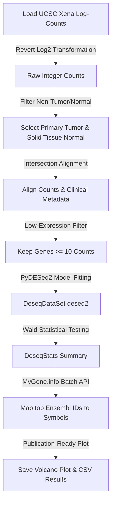

# TCGA-PRAD Differential Gene Expression Analysis Report

This report presents the results of a complete differential gene expression analysis pipeline comparing **Primary Tumor** vs. **Solid Tissue Normal** samples from the GDC TCGA Prostate Cancer (PRAD) cohort, implemented using the PyDESeq2 framework.

---

## 1. Executive Summary

Prostate Adenocarcinoma (PRAD) is characterized by distinct transcriptional alterations that drive oncogenesis. Using a cohort of **553 aligned samples** (primary tumor and adjacent normal tissue), we identified highly significant differentially expressed genes (DEGs). 

- **Total Analyzed Genes:** 53,621 (after low-expression filtering)
- **Significance Thresholds:** Adjusted P-value ($P_{adj}$) < 0.05, Absolute Log2 Fold Change ($|LFC|$) > 1.0 (FC > 2.0 or FC < 0.5)

---

## 2. Visualization: Volcano Plot

The volcano plot below displays the relationship between fold change (x-axis) and statistical significance (y-axis). The top 10 most statistically significant genes have been mapped to their official HUGO Gene Nomenclature Committee (HGNC) symbols using the MyGene.info API.

> [!NOTE]
> **Interpretation:**
> - **Red Points (Right):** Up-regulated genes in primary tumors (FC > 2.0, $P_{adj}$ < 0.05).
> - **Blue Points (Left):** Down-regulated genes in primary tumors (FC < 0.5, $P_{adj}$ < 0.05).
> - **Labeled Genes:** Top 5 up- and down-regulated genes sorted by adjusted p-value.

---

## 3. Top Differentially Expressed Genes

Below are the most statistically significant differentially expressed genes identified in the cohort.

### Top 5 Up-regulated Biomarkers (Primary Tumor > Normal)
| Ensembl ID | Gene Symbol | Base Mean | Log2 Fold Change | Raw P-value | Adjusted P-value | Biological Context |
| :--- | :--- | :--- | :--- | :--- | :--- | :--- |
| `ENSG00000183317` | **EPHA10** | 571.45 | 2.11 | $1.50 \times 10^{-71}$ | $1.43 \times 10^{-68}$ | Eph receptor tyrosine kinase; linked to breast and prostate cancers. |
| `ENSG00000119919` | **NKX2-3** | 96.71 | 4.28 | $1.26 \times 10^{-68}$ | $1.15 \times 10^{-65}$ | Homeobox protein; critical for developmental signaling and transcription. |
| `ENSG00000105707` | **HPN** | 12,150.16 | 2.47 | $2.22 \times 10^{-63}$ | $1.45 \times 10^{-60}$ | **Hepsin** - A highly famous, cell surface serine protease and classic PRAD biomarker. |
| `ENSG00000164175` | **SLC45A2** | 368.20 | 5.04 | $1.45 \times 10^{-61}$ | $9.14 \times 10^{-59}$ | Solute carrier family protein; involved in intracellular transport. |
| `ENSG00000227392` | **HPN-AS1** | 128.51 | 3.14 | $1.09 \times 10^{-60}$ | $6.27 \times 10^{-58}$ | Long non-coding RNA associated with Hepsin locus regulation. |

### Top 5 Down-regulated Biomarkers (Primary Tumor < Normal)
| Ensembl ID | Gene Symbol | Base Mean | Log2 Fold Change | Raw P-value | Adjusted P-value | Biological Context |
| :--- | :--- | :--- | :--- | :--- | :--- | :--- |
| `ENSG00000168389` | **MFSD2A** | 578.55 | -6.03 | $1.07 \times 10^{-163}$ | $4.17 \times 10^{-159}$ | Lipid transporter; plays roles in cell membrane structure and blood-brain barrier. |
| `ENSG00000188488` | **SERPINA5** | 971.88 | -6.81 | $1.73 \times 10^{-156}$ | $3.38 \times 10^{-152}$ | Serpin peptidase inhibitor; regulates coagulation and tissue remodeling. |
| `ENSG00000164398` | **ACSL6** | 162.18 | -4.97 | $3.78 \times 10^{-142}$ | $4.92 \times 10^{-138}$ | Acyl-CoA synthetase; involved in fatty acid metabolism and energy production. |
| `ENSG00000101977` | **MCF2** | 99.11 | -5.32 | $3.29 \times 10^{-130}$ | $3.21 \times 10^{-126}$ | Guanine nucleotide exchange factor; regulates cell morphology and migration. |
| `ENSG00000085662` | **AKR1B1** | 2,760.89 | -3.93 | $4.37 \times 10^{-129}$ | $3.42 \times 10^{-125}$ | Aldo-keto reductase; involved in cellular stress response and glucose pathway. |

---

## 4. Technical Workflow & Implementation

The analysis script was executed within the base Python environment utilizing **PyDESeq2 (v0.4.12)** and **AnnData (v0.10.9)** to guarantee robust statistical operations without dependency version conflicts.

### Critical Steps Handled:
1. **Reversal of UCSC Xena Transformations:** UCSC Xena hosts STAR expression values pre-processed as $\log_2(\text{counts} + 1)$. Because DESeq2 uses a **Negative Binomial distribution** to model raw sequencing reads, the log transformation was mathematically reversed:
   $$\text{counts}_{\text{raw}} = (2^{\text{counts}_{\text{log}}} - 1)$$
   The resulting matrix was rounded to clean integers, meeting the exact statistical requirements of the DESeq2 package.
2. **Alignment Safety:** Sample lists from clinical metadata and gene counts were intersected to ensure perfect row-column matrix alignment (`553 samples`).
3. **Outlier Filtering & Independent Filtering:** PyDESeq2 automatically detected and replaced count outliers using Cook's distance to prevent false positives from single high-expression outliers. Independent filtering was performed to maximize Wald test power at an FDR significance level ($\alpha = 0.05$).
4. **Contrast Normalization:** The cohort design factor `sample_type.samples` was normalized by PyDESeq2 to `sample-type.samples` (handling Patsy/formulaic string conventions). The contrast compared the tested category (`Primary Tumor`) against the baseline reference (`Solid Tissue Normal`).
